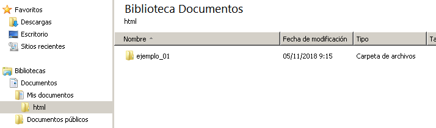
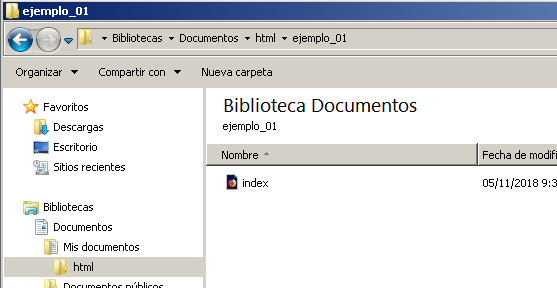
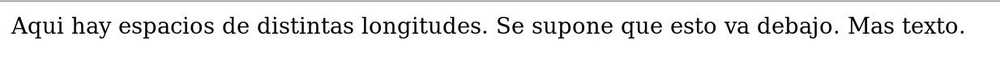

.. Apuntes de HTML documentation master file, created by
   sphinx-quickstart on Mon Nov  5 09:41:25 2018.
   You can adapt this file completely to your liking, but it should at least
   contain the root `toctree` directive.

Apuntes de HTML
===========================================

.. toctree::
   :maxdepth: 2
   :caption: Índice

Introducción
=======================

En este texto se da una introducción **muy básica** a la creación de páginas web. Para poder seguir estos apuntes basta con un ordenador que disponga de un editor de textos (puede bastar el "Bloc de Notas" de Windows). No es necesario disponer de conexión a Internet, ya que todos los ejemplos se almacenarán en el propio disco del equipo.

Se recomienda la creación de una carpeta (puede hacerse por ejemplo en el directorio "Mis documentos") a la que llamaremos "html". Dentro de ella iremos creando otras carpetas a las que iremos llamando "ejemplo_01", "ejemplo_02", etc... Como se verá más adelante, dentro de cada carpeta iremos poniendo muchos archivos que compondrán las diversas web de ejemplo que vayamos creando.

Los apuntes se han dividido en capítulos muy pequeños y lo más autocontenidos posible para intentar facilitar la asimilación de los conceptos en ellos presentados.

Los navegadores
===================

Cuando accedemos a Internet normalmente lo hacemos usando programas llamados "navegadores" (a veces también "browsers"). Hay muchos navegadores, algunos de los mas conocidos son:

* Firefox
* Chrome
* Internet Explorer (ahora conocido como Edge.)

Pregunta: navegadores
-----------------------

*¿Se puede acceder a cualquier web con cualquier navegador?*

Respuesta: **SÍ**. De hecho aquí está una de las fortalezas de la web.

.. IMPORTANT::
   Los navegadores descargan páginas escritas en un lenguaje llamado HTML que está **ESTANDARIZADO**. Gracias al estándar, cualquier persona o empresa puede crear un navegador o incluso un servidor de páginas web (e intentar venderlo si así lo desea).
   
El organismo que estandariza el lenguaje HTML es el World Wide Web Consortium o W3C y es un organismo sin ánimo de lucro que establece las reglas del lenguaje. Gracias a estos estándares libres, abiertos y gratuitos la Web ha podido avanzar muchísimo. A modo de ejemplo, las figuras siguientes muestran una página web mostrada en distintos navegadores.

.. figure:: imagenes/Captura_google.png
   :scale: 50%
   
   Captura de un buscador usando Mozilla Firefox.
   
   
.. figure:: imagenes/Captura_google_chrome.png
   :scale: 50%
   
   Captura de un buscador usando Google Chrome.
   
.. WARNING::
   En realidad, podría haber pequeñas diferencias pero este problema ocurre cada vez menos y se espera que con el tiempo haya cada vez menos diferencias.
   
En suma, lo importante es que el lenguaje es **abierto** y el W3C incluso publica los estándares del lenguaje para aquellos interesados en conocer los detalles más internos. Sin embargo, tales detalles quedan fuera del alcance de estos apuntes.

Primera página HTML
=====================

Antes de empezar vayamos al directorio "Mis documentos" y entremos dentro de la carpeta "html" que hicimos en su momento. Fabriquemos una nueva carpeta a la que llamaremos "ejemplo_01". Deberíamos ver algo como lo que muestra la figura.

   
   Estructura de carpetas

Si ahora abrimos el "Bloc de notas" deberíamos ver algo como esto (este programa debería estar en el botón "Inicio" y dentro de él en "Accesorios").

   
   Bloc de notas
   
   
Ahora podremos utilizar este programa para teclear nuestra primera página web.

Antes de empezar es importante conocer que HTML utiliza **marcas** para indicar como debe aparecer el texto en pantalla. Las marcas se escriben utilizando los símbolos "<" y ">". Dependiendo del teclado pueden estar en distintos sitios pero lo más común es que estén en la zona inferior izquierda del teclado y al lado de la tecla "z". Así una marca puede ser algo como "<h1>" o "<table>". Estas marcas **son la clave del lenguaje** ya que todo el lenguaje consta de marcas que nos permiten conseguir que la página se muestre como queremos. De hecho HTML significa HyperText Mark-up Language (algo así como "Lenguaje de marcas para hipertexto").

Además las marcas suelen tener una *apertura* y un *cierre*. Una marca de apertura podría ser "<h1>" y una de cierre "</h1>". El símbolo "/" suele estar en el teclado, en la tecla "7" y normalmente hay que pulsar la tecla "Mayúsculas" y "7" a la vez pero puede variar según el teclado.

Usemos ahora el Bloc de notas (a veces también llamado "editor") para escribir lo siguiente. En clase veremos que la estructura se puede modificar y por ejemplo se pueden escribir dos marcas seguidas o se puede dejar más de una línea en blanco, sin embargo las marcas sí deben escribirse exactamente igual.

.. code-block:: html

   <!DOCTYPE html>
   <html>
    <head>
        <meta charset="utf-8">
        <title>
            Mi primera página web
        </title>
    </head>
    <body>
        <h1>Un ejemplo de página web</h1>
    </body>
   </html>
   
Una vez teclado, nos vamos al menú "Archivo" y dentro de él veremos una opción que pone "Guardar como". Guardaremos el archivo con el nombre "index.html" [#index]_ e indicaremos que **no vamos a guardar con la extensión .txt, sino que marcaremos la opción "Todos los archivos"**

.. figure:: imagenes/bloc_de_notas_guardando.png
   :scale: 30%
   
   Guardando el archivo.
   

Por desgracia el "Bloc de notas" intenta siempre guardar los archivos como "archivo.txt" y al crear páginas web nos interesa guardarlas como "loquesea.html", así que necesitaremos hacer esto.

Una vez hecho esto podemos ir a la carpeta "Mis documentos" y dentro de "html" deberíamos ver la carpeta "ejemplo_01" que debe contener el archivo "index.html" tal como muestra la figura siguiente:

   
   Nuestro archivo index.html
   
Si se hace doble click en dicho archivo deberíamos ver como el navegador de nuestro sistema muestra nuestra primera página web.

.. figure:: imagenes/primera_pagina.png
   :scale: 30%
   
   El navegador mostrando nuestra primera página web.
   
   
Si algo no funciona puede ser por alguno de estos motivos:

* Si al hacer doble click la página no se abre puede que tengamos que abrir primero el navegador y desde él usar el menú "Archivo" y luego "Abrir". Despues podremos ir a la carpeta "Mis documentos", "html", "ejemplo_01" y seleccionar el archivo "index.html"
* Si la página se abre pero no se muestra lo mismo que en la figura casi al 100% ha habido algún error al copiar las marcas. Vuelve al bloc de notas y repasa que todas las marcas sean exactamente iguales.
* Si ves que se ven mal los acentos prueba a modificar la marca ``<meta>``. Escribe ``<meta charset="iso-8859-1">``.

   
Estructura de una página web
===============================

Analicemos otra vez el fichero anterior.

.. code-block:: html

   <!DOCTYPE html>
   <html>
    <head>
        <meta charset="utf-8">
        <title>
            Mi primera página web
        </title>
    </head>
    <body>
        <h1>Un ejemplo de página web</h1>
    </body>
   </html>
   
   
Como puede verse hay marcas de apertura (como "<html>") y de cierre (como "</html>"). Como puede verse se pueden meter marcas dentro de otras marcas y componer así la estructura básica de una página web. En los puntos siguientes analizamos la estructura.

* Toda página lleva un preámbulo. En concreto la marca ``<!DOCTYPE html>``. Esta es una de las pocas marcas que no necesitarán cierre y en concreto sirve para indicar la versión del lenguaje. En el pasado se usaban otras cosas (direcciones web en lugar de "html" pero recientemente el mecanismo se simplificó.
* Toda página empieza por la marca ``<html>`` y se cierra con ``</html>``.
* Toda página debe llevar una cabecera y un cuerpo. La cabecera se marca con ``<head>`` y ``</head>`` y el cuerpo con ``<body>`` y ``</body>``.
* La cabecera contendrá elementos **que no se mostrarán directamente en la página web**. Mas adelante veremos alguno de esos elementos, por ahora solo hemos puesto la marca ``<title>`` que muestra el título de la página (pero solo en la barra del navegador).
* Una de las marcas que ponemos se llama ``<meta>`` y contiene datos sobre *el juego de caracteres*. Hablaremos de esta marca más adelante.
* Dentro del cuerpo se pondrán todos los elementos que sí formen parte directa de la página: enlaces, imágenes, botones... En este caso y por simplificar solo hemos puesto un pequeño texto rodeado por la marca ``<h1>``. Esta marca en concreto hace que el texto aparezca como una "cabecera de nivel 1" (el navegador suele mostrar dicho texto con un tamaño más grande).

Ejercicio: niveles de encabezamiento
--------------------------------------

Prueba a cambiar el fichero de la página para que contenga esto

.. code-block:: html

   <!DOCTYPE html>
   <html>
    <head>
        <meta charset="utf-8">
        <title>
            Ejemplo de etiquetas de encabezamiento.
        </title>
    </head>
    <body>
        <h1>Soy un texto con h1</h1>
        <h2>Soy un texto con h2</h2>
        <h3>Soy un texto con h3</h3>
        <h4>Soy un texto con h4</h4>
        <h5>Soy un texto con h5</h5>
        <h6>Soy un texto con h6</h6>
    </body>
   </html>

Asegúrate de guardar,vuelve al navegador y usa el botón "recargar" (depende del navegador pero suele ser una flecha circular). También puedes hacer doble click sobre el fichero y/o usar la tecla F5 en el navegador. ¿Qué se muestra?

El juego de caracteres
=================================================
En los comienzos de HTML era muy incómodo el escribir páginas con otro alfabeto que no fuera el anglosajón. Para evitar problemas con los símbolos propios del español (la ñ, las letras con acentos, etc...) se puede indicar al principio cual es el "alfabeto" o "juego de caracteres que usamos". La costumbre es que desde hace tiempo todos los editores como Bloc de notas y similares usen una codificación llamada "utf-8". Sin embargo, es posible que tu programa use un juego de caracteres distinto. 

En la figura adjunta se muestra el Bloc de Notas. Cuando nos vamos al menú "Archivo" y elegimos la opción "Guardar como..." veremos una ventana parecida a la siguiente. Como puede verse, el bloc de notas de la figura *intenta en principio guardar usando la codificación ANSI.* Sin embargo, antes de pulsar el botón "Guardar" podemos elegir de la lista desplegable la opción "UTF-8" y poner en nuestra página HTML la etiqueta ``<meta charset="utf-8">``

.. figure:: imagenes/bloc_notas_utf.png

   Forzando al editor a guardar la página usando la codificación correcta.

HTML. Consideraciones previas
================================

Al crear una página web con HTML hay algunos detalles sutiles como los siguientes:

Colocación de las marcas
--------------------------
Al navegador le da igual como coloquemos las marcas. Observa como el navegador muestra lo mismo que en los ejemplos anteriores cuando escribimos la misma página de esta manera.

.. code-block:: html

   <!DOCTYPE html>
   <html><head>
        <title>Mi primera página web</title>
    </head>
    <body>
        <h1>Un ejemplo de página web</h1> </body>  </html>

Como puede verse, el navegador ignora la posición de las marcas **y muestra exactamente lo mismo**. Debido a eso la costumbre es colocar las marcas de manera que "mas o menos se vea la estructura". De hecho podría escribirse toda la página web en una sola línea y el navegador seguiría haciendo lo mismo.

.. figure:: imagenes/primera_pagina.png
   :scale: 30%
   
   El navegador ignora la posición de las marcas.

Líneas en blanco
-----------------

Las líneas en blanco que escribimos con la tecla ``ENTER`` **son completamente ignoradas**. Prueba esta página

.. code-block:: html

   <!DOCTYPE html>
   <html>
    <head>
        <title>
            Líneas en blanco
        </title>
    </head>
    <body>
        Este texto está en una línea.
        Este texto se supone que está en otra línea distinta.
        
        
        Este texto está varias líneas mas abajo.
    </body>
   </html>

Sin embargo, observa lo que muestra el navegador.

.. figure:: imagenes/lineas_en_blanco.png
   :scale: 60%
   
   El navegador **ignora las líneas en blanco**
   
Una pregunta muy típica es entonces *"¿como consigo escribir texto en otra línea?*. La respuesta es: utilizando una marca especial llamada `` ``. Observa cuidadosamente la posición de la barra, ya que en este caso no es un error. Algunas marcas que no llevan nada dentro pueden escribirse de esta manera.

Existe otra marca llamada ``
`` (que se cierra como ``
``) que indica el comienzo y el final de un párrafo. Probemos a escribir esto.

.. code-block:: html

   <!DOCTYPE html>
   <html>
    <head>
        <title> Párrafos  </title>
    </head>
    <body>
        
 Este texto es un párrafo que puede ser muy largo. 

        
 Este texto es un párrafo distinto. 

    </body>
   </html>

Veremos que el navegador muestra esto:

   
   Separación de párrafos hecha por el navegador.
   
Primeras marcas
=============================================================================

A continuación veremos algunas marcas que modifican el texto

* La marca ``<b>`` permite poner un trozo de texto en negrita.
* La marca ``<i>`` permite poner un trozo de texto en cursiva.
* La marca ``<u>`` permite subrayar un trozo de texto.

Además estas marcas se pueden combinar unas dentro de otras pero **se debe recordar cerrar las marcas en orden inverso al que se abrieron**. A modo de ejemplo, vayamos a "Mis documentos" y dentro de ella a la carpeta "html" y fabriquemos una carpeta "ejemplo_02". Si abrimos el bloc de notas y creamos este archivo...

.. code-block:: html

    <!DOCTYPE html>
    <html>
    <head>
        <title>Primeras marcas</title>
    </head>
    
    <body>
    En este texto <b>algunas cosas van en negrita</b>,
    mientras que <i>otras van en cursiva</i>. Hay otras que
    <u>se han subrayado</u>. Además, algunas cosas
    van en <b><i>negrita y cursiva</i></b> y algunas
    <i><u><b>llevan las tres cosas a la vez</b></u></i>
    </body>
    </html>

...entonces podremos visualizar qué ocurre. Como puede verse se han mezclado las etiquetas y esto puede hacerse siempre y en cualquier orden pero **recordando cerrar en orden inverso**. Por ejemplo, en el archivo hemos puesto las tres cosas (negrita, cursiva y subrayado) abriendo con ``<i><u><b>``. Así, luego hemos cerrado con ``</b></u></i>``

   
   Primeras marcas

Enlaces e imágenes
=================================================

Las etiquetas de formato básico ya muestran algo, pero con esto no es suficiente para crear una página web. En esta sección veremos como crear enlaces y como insertar imágenes.

Para crear un enlace vamos a necesitar dos cosas:

1. Un texto que el usuario verá.
2. Una dirección web donde queremos que el usuario vaya al pulsar el enlace.

Fabriquemos una carpeta "ejemplo_03" y dentro de ella creemos el siguiente archivo al que llamaremos "index.html"

.. code-block:: html

    <!DOCTYPE html>
    <html>
    <head>
        <title>Nuestro primer enlace</title>
    </head>
    <body>
        <a href="www.google.com">Esto es un enlace a Google.</a>
    </body>
    </html>

Si lo guardamos y lo abrimos con el navegador veremos algo como esto (obsérvese que lo hemos abierto en un navegador diferente, pero esto no influirá en nada).

.. figure:: imagenes/primer_enlace.png

   Un primer enlace.

Como puede verse, ahora la etiqueta no es simplemente ``<a>`` sino que hay información adicional. Esta información adicional a las marcas se llama **atributo**. Así esta marca dice dos cosas:

1. Lo que hay dentro de la marca debe mostrarse como un enlace. Dentro de la marca podemos poner el texto que queramos.
2. Dicho texto, al ser pulsado llevará al usuario a ``http://google.com``.

A continuación vamos a ver como trabajar con imágenes. Antes de seguir consigue una imagen (puedes descargarla de Internet o mirar en "Mis imágenes"). Copia el fichero de imagen al directorio "ejemplo_02" que hemos creado (es decir, deberías tener en la carpeta el fichero "index.html" y el fichero de imagen, en nuestro caso se llama "estrella.jpg". Una vez tengas el fichero amplia el fichero y añade la imagen debajo del enlace, el fichero te debería quedar así:

.. code-block:: html

    <!DOCTYPE html>
    <html>
    <head>
        <title>Nuestro primer enlace</title>
    </head>
    <body>
        <a href="www.google.com">Esto es un enlace a Google.</a>
         
        
    </body>
    </html>

A continuación se puede ver el resultado.

   Un ejemplo de imagen.

Como puede verse, la etiqueta ``img`` ahora lleva 3 atributos:

* El atributo ``src`` indica el nombre del fichero de imagen que hay que mostrar.
* El atributo ``width`` indica la anchura en píxeles que debe tener la imagen.
* El atributo ``height`` indica la altura que debe tener la imagen.

Trabajar con imágenes puede ser complicado. Si cogemos una imagen pequeña y la forzamos a que tenga un tamaño muy grande hará que se vean los píxeles. Si cogemos una imagen muy grande y la forzamos a que tome un tamaño pequeño no producirá ningún problema visual (de hecho se veá muy bien) pero hará que la página web sea mas "pesada" y pueda tardar más en cargar.

Ejercicio: mezcla de etiquetas.
--------------------------------------------------

Teclea esta página pero antes de abrirla en el navegador piensa: ¿qué crees que ocurrirá?

.. code-block:: html

    <!DOCTYPE html>
    <html>
    <head>
        <title>Ejercicio</title>
    </head>
    <body>
        
    </body>
    </html>

Espacios en blanco
=================================================

En HTML los espacios en blanco no actúan de la misma manera que en el Bloc de Notas o Word. De hecho, el navegador trata un espacio igual que cinco espacios o que cien líneas en blanco: todos ellos equivalen exactamente a un espacio en blanco. Por ejemplo, tecleemos la siguiente página:

.. literalinclude:: ejemplos_html/ejemplo_04/espacios_en_blanco.html
   :language: html

Si la mostramos en el navegador veremos esto:

   El navegador no crea líneas nuevas.

La clave es que para saltar de líneas **también se tienen que usar marcas**. Así, hay dos grandes formas:

* La primera es usar simplemente la marca `` ``.
* La segunda es usar la marca ``
`` con ``
`` que lo que hace es *delimitar párrafos*. El archivo siguiente ilustra como usarlas.

.. literalinclude:: ejemplos_html/ejemplo_05/lineas_en_blanco.html
   :language: html

.. rubric:: Footnotes
   
.. [#index] En realidad una página se puede llamar como se quiera, pero la costumbre es que la página inicial de un sitio web se llame precisamente así "index.html"